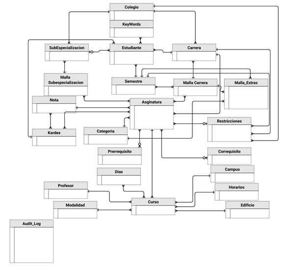

# Proyecto Integrador - Eduardo Guerrero A. #

## Table of Contents
1. [Introducción](#introducción)
    - [Orden de las carpetas](#orden-de-las-carpetas)
    - [Especificaciones Utilizadas](#especificaciones-utilizadas)
        - [Librerías de Python](#librerias-de-python)
2. [Base de Datos](#base-de-datos)
    - [Detalle de las tablas](#detalle-de-las-tablas)
    - [Detalles de los datos insertados](#detalles-de-los-datos-insertados)
    - [Stored Procedures](#stored-procedures)
    - [Índices](#índices)
    - [Triggers](#triggers)
    - [Diagrama de Entidades](#diagrama-de-entidades)
    - [Modelo Relacional](#modelo-relacional)
3. [Django y Bootstrap](#django-y-bootstrap)
    - [Crear Proyecto](#crear-proyecto)
    - [Crear Aplicación](#crear-aplicación)
    - [Modelos](#modelos)
    - [Vistas](#vistas)
    - [Templates](#templates)
4. [Sistema de Recomendacion](#sistema-de-recomendacion)
    - [Variantes de tf_idf utilizadas](#variantes-de-tf_idf-utilizadas)
    - [Modelos de Keybert utilizados](#modelos-de-keybert-utilizados)

## Introducción ##

El siguiente repositorio contiene el código utilizado para realizar el proyecto integrador **"Diseño e implementación de una guía curricular basada en inteligencia artificial"**. Para eso, el repositorio cuenta con tres carpetas que dividen el proyecto en sus tres grandes componentes. Además, se encuentran en el orden en el cual fueron implementados.
### Orden de las carpetas

1. **Base_de_Datos**: Scripts referentes para la creacion de la base de datos, tablas e inserción de datos.
2. **Django**: Proyecto Django para la creación de la página web, donde se enlaza a la base de datos y se utiliza el framework Bootstrap para el front end.
3. **Sistema_de_recomendacion**: Scrips referentes al sistema de creacion. Incluye pruebas para obtener palabras clave y para buscar documentos según un query.

### Especificaciones utilizadas ###
Para el siguiente proyecto se utilizó lo siguiente

* Visual Studio Code versión 1.93.1
* MySQL Workbench versión 8.0
* Python version 3.11.5
* Django versión 5.1.1

#### Librerias de Python ####
Los scripts de python utilizan las siguientes librerias:
* **bs4** - BeautifulSoup: Para extraer datos de archivos HTML y XML.
* **collections** - Counter: Para contar elementos hashables.
* **collections** - defaultdict: Para crear diccionarios con valores por defecto.
* **csv**: Para leer y escribir archivos CSV.
* **deep_translator** - GoogleTranslator: Para traducir texto utilizando Google Translate.
* **keybert** - KeyBERT: Para la extracción de palabras clave.
* **nltk.corpus** - stopwords: Para manejar palabras vacías en procesamiento de lenguaje natural.
* **os**: Para interactuar con el sistema operativo.
* **pandas**: Para manipulación y análisis de datos.
* **pymsql**: Para interactuar con bases de datos MySQL.
* **random**: Para generar números aleatorios.
* **re**: Para trabajar con expresiones regulares.
* **sklearn.features.extraction.text** - TfidfVectorizer: Para convertir una colección de documentos en una matriz de TF-IDF.
* **sklearn.preprocessing** - MinMaxScaler: Para escalar características a un rango dado.
* **spacy**: Para procesamiento avanzado de lenguaje natural.
* **tqdm**: Para mostrar barras de progreso.
* **zipfile**: Para trabajar con archivos ZIP.

**Nota**: Estas librerias no incluyen las que vienen por defecto al crear un proyecto en Django

## Base de Datos ##
La base de datos ha sido realizada en mySql Workbench y cuenta con las siguientes características:

### Detalle de las tablas ###

| Tabla | Descripción | Columnas Principales |
|-------|-------------|---------------------|
| Colegio | Almacena información sobre los colegios | - Colegio_id<br>- Nombre<br>- Abreviatura |
| KeyWords | Contiene palabras clave que los estudiantes pueden seleccionar | - Keyword_id<br>- Palabra |
| Semestre | Representa los semestres académicos | - Semestre_id<br>- Nombre |
| Notas | Define las calificaciones disponibles | - Nota_id<br>- Nota |
| Categoria | Clasifica las asignaturas en diferentes categorías | - Categoria_id<br>- Nombre |
| Profesor | Almacena información sobre los profesores | - Profesor_id<br>- Nombre<br>- Correo |
| Dias | Contiene información sobre los días de la semana | - Dia_id<br>- Abreviatura<br>- Nombre |
| Horario | Define los intervalos de tiempo para las clases | - Horario_id<br>- Hora |
| Edificio | Almacena información sobre los edificios | - Edificio_id<br>- Abreviatura<br>- Nombre |
| Modalidad | Define el tipo de modalidad de los cursos | - Modalidad_id<br>- Nombre |
| Carrera | Almacena información sobre las carreras | - Carrera_id<br>- Colegio_id<br>- Abreviatura<br>- Nombre |
| SubEspecializacion | Almacena información sobre subespecializaciones | - SubEsp_id<br>- Colegio_id<br>- Nombre |
| Estudiante | Almacena información sobre los estudiantes | - Estudiante_id<br>- Nombres<br>- Apellidos<br>- Correo<br>- Contraseña |
| Palabra_Estudiante | Relación entre estudiantes y palabras clave | - Palabra_Estudiante_id<br>- Keyword_id<br>- Estudiante_id |
| Asignatura | Almacena información sobre las asignaturas | - Asignatura_id<br>- Nombre<br>- Descripcion<br>- Creditos |
| Prerrequisito | Almacena información sobre los prerrequisitos | - Prerrequisito_id<br>- Asignatura_id<br>- Dependencia_id |
| Malla_Subespecializacion | Almacena la malla curricular de subespecializaciones | - MallaSubEsp_id<br>- SubEsp_id |
| MallaSubEsp_Asignatura | Relaciona asignaturas con subespecializaciones | - MallaSub_Asig_id<br>- MallaSubEsp_id<br>- Asignatura_id |
| Malla_Carrera | Almacena la malla curricular de carreras | - MallaCarrera_id<br>- Carrera_id |
| MallaCarreraAsignatura | Relaciona asignaturas con mallas de carrera | - MallaCarreraAsignatura_id<br>- MallaCarrera_id<br>- Asignatura_id |
| Campus | Almacena información sobre los campus | - Campus_id<br>- Nombre |
| Kardex | Almacena el kardex académico | - Kardex_id<br>- Estudiante_id |
| Kardex_Asignatura | Relaciona asignaturas con el kardex | - Kardex_Asignatura_id<br>- Kardex_id<br>- Asignatura_id |
| Curso | Almacena información sobre los cursos | - Curso_id<br>- Asignatura_id<br>- Profesor_id<br>- Cupo |
| Dias_Asignatura | Define qué días se imparte cada curso | - Dias_Asignatura_id<br>- Curso_id<br>- Dia_id |
| Correquisito | Almacena información sobre correquisitos | - Correquisito_id<br>- Asignatura_id<br>- Correquisito_Asignatura_id |
| Restricciones | Define restricciones en la inscripción | - Restriccion_id<br>- Asignatura_id<br>- Carrera_id |
| Audit_Log | Almacena registros de auditoría | - Audit_id<br>- Fecha<br>- Usuario<br>- Tabla_Modificada |
| Malla_Extras | Almacena información sobre optativas y electivas | - MallaExtras_id<br>- MallaCarrera_id<br>- Categoria_id |

### Detalles de los datos insertados

**Nota** Ciertos datos son ficticios y ciertos datos han sido agregados utilizado data scraping con la libreria bs4.

| Tabla  | Cantidad de Elementos |
|--------|----------------------|
| Asignatura | 186 |
| Campus | 3 |
| Carrera | 57 |
| Categoría | 15 |
| Colegio | 11 |
| Correquisito | 3 |
| Curso | 930 |
| Días | 7 |
| Días Asignatura | 1816 |
| Edificio | 22 |
| Estudiante | 101 |
| Horario | 10 |
| Kardex | 5 |
| Kardex Asignatura | 125 |
| Keywords | 50 |
| Malla Carrera | 5 |
| Malla Extras | 48 |
| Malla Subespecialización | 5 |
| Modalidad | 4 |
| Notas | 6 |
| Palabra Estudiante | 505 |
| Prerrequisito | 64 |
| Profesor | 212 |
| Restricciones | 49 |
| Semestre | 12 |
| Subespecialización | 74 |

### Stored Procedures ###

| Stored Procedure | Descripción | Parámetros de Entrada |
|-----------------|-------------|----------------------|
| ObtenerAsignaturasRestantes | Muestra materias no cursadas/aprobadas agrupadas por categoría | - EstudianteId (INT) |
| ObtenerKardexEst | Devuelve el historial académico del estudiante | - student_id (INT) |
| GetMallaCarrera | Muestra la malla curricular completa de una carrera | - carrera_id (INT) |
| ObtenerDetallesAsignatura | Proporciona detalles y prerrequisitos de una asignatura | - asignaturaId (INT) |
| VerificarPrerrequisitos | Verifica si un estudiante cumple los prerrequisitos | - p_Estudiante_id (INT)<br>- p_Asignatura_id (INT) |
| ObtenerCorrequisitos | Recupera los correquisitos de una asignatura | - p_asignatura_id (INT) |
| ObtenerInformacionAsignatura | Obtiene restricciones y detalles de una asignatura | - asignaturaID (INT) |
| VerificarRestriccionesEstudiante | Verifica si un estudiante cumple con las restricciones | - estudianteID (INT)<br>- asignaturaID (INT) |
| getOptativas | Lista asignaturas optativas disponibles para inscripción | - EstudianteID (INT) |
| GetElectivas | Lista asignaturas electivas disponibles para inscripción | - EstudianteID (INT) |
| VerCursos | Muestra información detallada de cursos de una asignatura | - asignaturaId (INT) |
| getSubEspecializacion | Obtiene asignaturas de una subespecialización | - p_SubEsp_id (INT) |
| verSubEspRestantes | Muestra asignaturas pendientes de subespecialización | - p_Estudiante_id (INT) |
| verSubEspTomadas | Muestra asignaturas aprobadas de subespecialización | - p_Estudiante_id (INT) |

### Índices ###

| Nombre del Índice | Tabla | Columnas | Descripción |
|-----------------|--------|-----------|-------------|
| idx_kardex_asignatura_estudiante_asignatura | Kardex_Asignatura | Aprobada | Optimiza consultas relacionadas con la tabla Kardex_Asignatura, especialmente aquellas que filtran por la columna Aprobada |
| idx_asignatura | Asignatura | Nombre | Mejora la eficiencia de las consultas que buscan información sobre las asignaturas por nombre |
| idx_carrera_abrv | Colegio | Abreviatura | Acelera las consultas que filtran por la abreviatura del colegio |
| idx_asignatura_num | Asignatura | Numero | Facilita las consultas que buscan asignaturas utilizando la columna Numero |

### Triggers ###

| Tipo de Trigger | Cuándo se Activa | Acciones Realizadas | Almacenamiento |
|-----------------|-----------------|-------------------|----------------|
| AFTER DELETE | Después de eliminar un registro | - Captura usuario<br>- Captura tabla<br>- Describe la eliminación | Se guarda en audit_log |
| AFTER INSERT | Después de insertar un registro | - Captura usuario<br>- Captura tabla<br>- Describe la inserción | Se guarda en audit_log |
| AFTER UPDATE | Después de actualizar un registro | - Captura usuario<br>- Captura tabla<br>- Describe la actualización | Se guarda en audit_log |

Todos los triggers:
- Se implementan en cada tabla
- Registran la información en la tabla audit_log
- Aseguran la trazabilidad de cambios
- Permiten auditar modificaciones
- Promueven la transparencia en la gestión de datos

### Diagrama de Entidades ###



### Modelo Relacional ###


## Django y Bootstrap

Para utilizar los scripts primero se deberá crear un proyecto y una aplicación en Django. Esto se realiza desde la línea de comandos. Es útil recordar que Django usa un modelo vista template.

### Crear Proyecto ###

Para crear un nuevo proyecto en Django, navega a la carpeta donde deseas crear el proyecto y ejecuta el siguiente comando:

```bash
django-admin startproject nombre_proyecto
```

### Crear Aplicación ###

Para crear una nueva aplicación dentro del proyecto Django, navega a la carpeta del proyecto y ejecuta el siguiente comando:

```bash
python manage.py startapp nombre_aplicacion
```

### Modelos ###

| Nombre del Modelo | Tabla de la Base de Datos |
|--------|----------------------|
| Carrera | Carrera |
| Semestre | Semestre |
| SubEspecializacion | SubEspecializacion |
| Estudiante | Estudiante |
| Keywords | Keywords |
| PalabraEstudiante | Palabra_Estudiante |


### Vistas ###

| Vista | Path |
|--------|----------------------|
| login_view | login/ |
| logout_view | login/ |
| table_user (login_required) | table_user/ |
| class_history (login_required) | history/ |

### Templates ###

* login.html
* table_user.html
* table_content.html
* history.html

## Sistema de Recomendacion ##

El sistema de recomendación utiliza dos métodos distintos para encontrar las palabras clave. Primero, *term frequency, inverse document frequency*, conocido como *tf_idf*. Segundo, utiliza KeyBERT, que aplica el modelo de inteligencia artificial BERT.

### Variantes de tf_idf utilizadas ###

| Term Frequency | Inverse Document Frequency |
|----------------|----------------------------|
| Natural        | Idf                        |
| Natural        | No                         |
| Logarítmico    | Idf                        |
| Logarítmico    | No                         |
| Logarítmico    | Probabilístico             |
| Aumentado      | Idf                        |
| Aumentado      | No                         |
| Aumentado      | Probabilístico             |
| Booleano       | Idf                        |
| Booleano       | No                         |
| Booleano       | Probabilístico             |

### Modelos de Keybert utilizados ###

| Modelo         | Parámetros utilizados |
|----------------|----------------------------|
| distilbert-base-nli-mean-tokens | N/A |
| distilbert-base-nli-mean-tokens | use_mmr = true<br>diversity = 0.2 |
| distilbert-base-nli-mean-tokens | use_mmr = true<br>diversity = 0.7 |
| sentence-transformers/distiluse-base-multilingual-cased-v1 | N/A |
| sentence-transformers/distiluse-base-multilingual-cased-v1 | use_mmr = true<br>diversity = 0.2 |
| sentence-transformers/distiluse-base-multilingual-cased-v1 | use_mmr = true<br>diversity = 0.7 |

